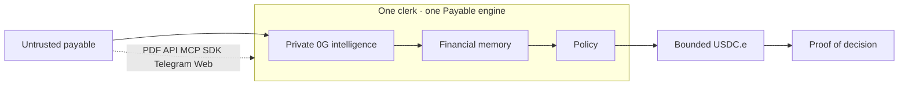
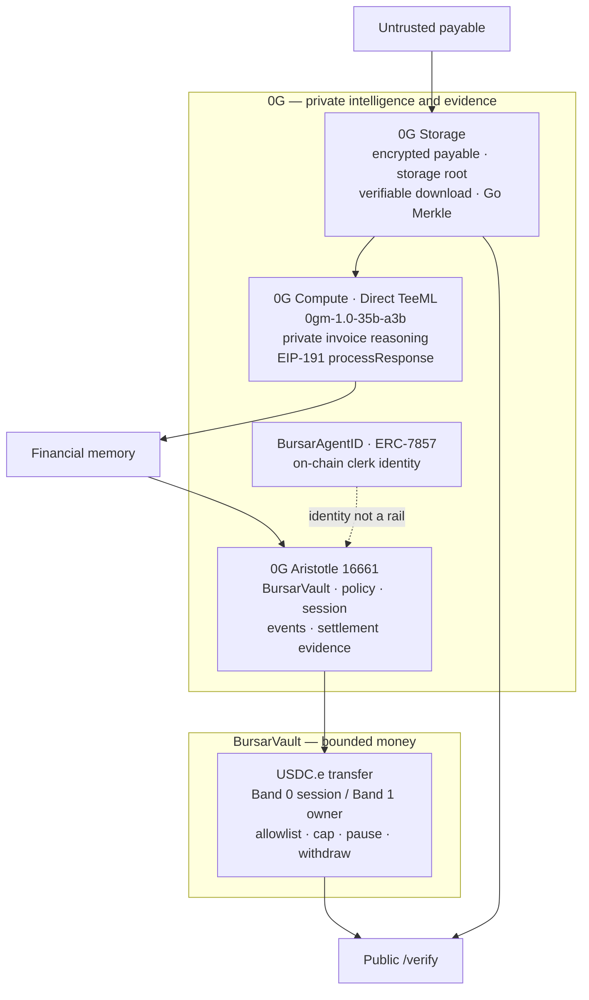
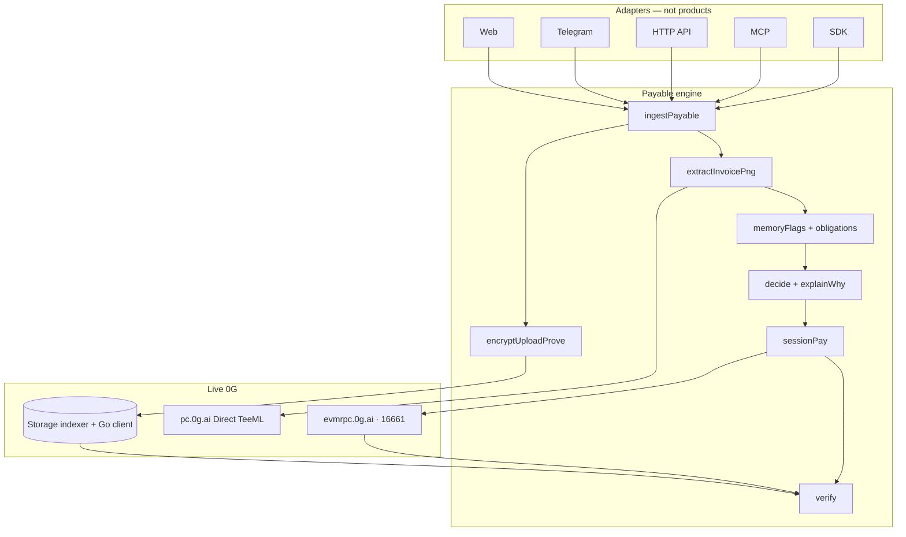
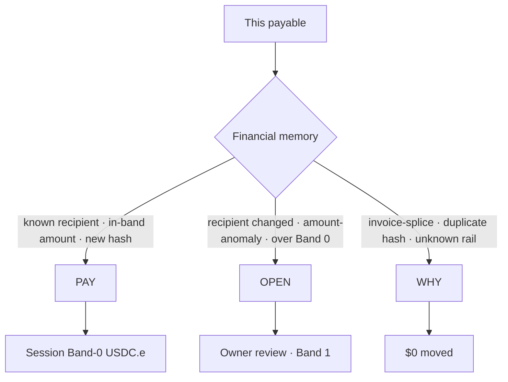
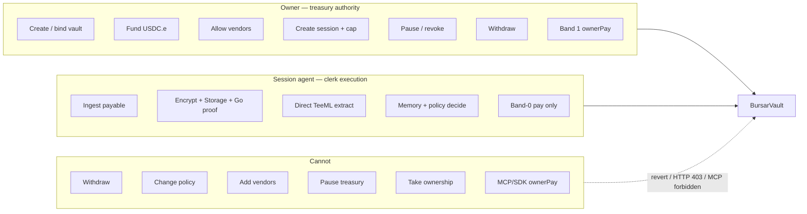
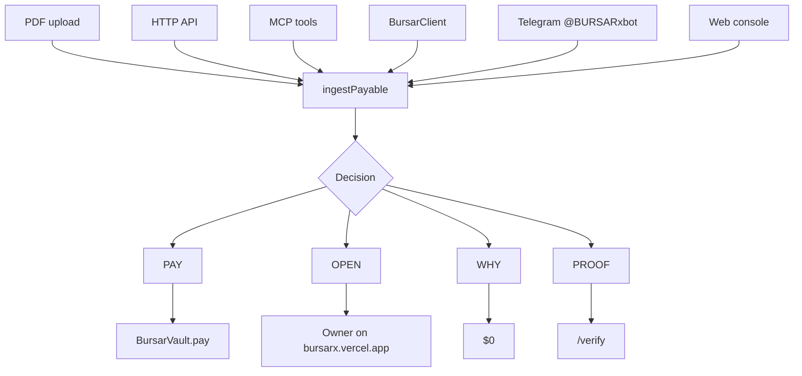
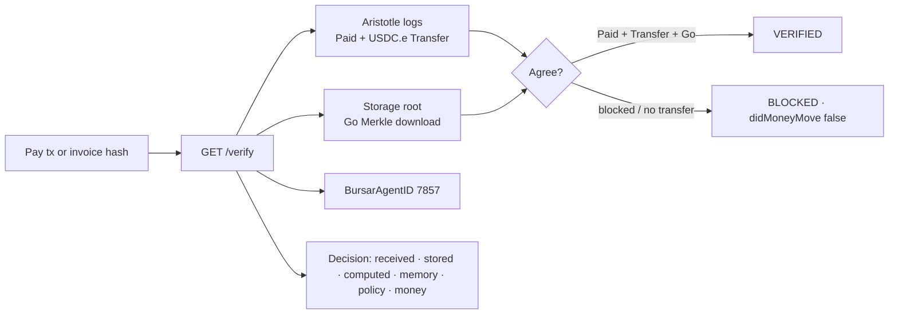

# BURSAR

[](https://github.com/james32135/BURSAR/actions/workflows/test.yml)

**A financial clerk that can privately understand an invoice, remember financial context, enforce policy, move bounded USDC.e, and prove why the decision happened.**

Untrusted payable → private 0G intelligence → financial memory → policy → bounded money → proof.

0G is the hero. Not a badge. Not a decorative integration. The clerk exists because 0G can hold an encrypted payable, run private invoice reasoning, and settle the decision on Aristotle with evidence anyone can reconstruct.

Without **0G Storage**, there is no verifiable source artifact.  
Without **0G Compute / Direct TeeML**, private invoice intelligence is missing.  
Without **0G Aristotle**, the system loses its on-chain execution and evidence substrate.  
Without **Memory**, the clerk cannot understand financial history.  
Without **Policy**, intelligence becomes unsafe.  
Without **bounded BursarVault execution**, reasoning cannot safely become money.  
Without **Proof**, nobody can independently reconstruct why money moved.

That is BURSAR.

| Live | URL |
| --- | --- |
| Console | [bursarx.vercel.app](https://bursarx.vercel.app) |
| Owner setup | [bursarx.vercel.app/start](https://bursarx.vercel.app/start) |
| Public desk | [bursarx.vercel.app/desk](https://bursarx.vercel.app/desk) |
| Public verify | [bursarx.vercel.app/verify](https://bursarx.vercel.app/verify) |
| Featured pay (VERIFIED) | [bursarx.vercel.app/verify/0xc8143fcb…](https://bursarx.vercel.app/verify/0xc8143fcb7db619ba4d67750faa728911433f2335731eb358d241c89123dcf0b1) |
| Invoice-splice ($0) | [bursarx.vercel.app/verify/0xb3f63638…](https://bursarx.vercel.app/verify/0xb3f63638b970cfbeadadd39d44ec1ad43a986cb8304a292b1182e6453b0c2a37) |
| API | [bursar-api.onrender.com/health](https://bursar-api.onrender.com/health) |
| Telegram | [@BURSARxbot](https://t.me/BURSARxbot) |
| Source | [github.com/james32135/BURSAR](https://github.com/james32135/BURSAR) |
| CI | [GitHub Actions `test`](https://github.com/james32135/BURSAR/actions/workflows/test.yml) |

**Try the desk**, nav **Desk**, and **Open console** open [Get started](https://bursarx.vercel.app/start): connect the owner wallet, resume or bind the vault, authorize the session agent. They do not open `/app` and they do not bind a stranger to the shared DEMO vault. DEMO is a labeled footer on `/start` only.

---

## The problem

Crypto teams still pay like a Discord channel with a spreadsheet. An invoice PDF arrives. Someone pastes a remittance address. A clerk who cannot remember last week’s amount, cannot see that the invoice number was already paid at a different hash, and cannot prove why the transfer happened, will eventually move money to the wrong place.

The failure is not “AI is missing.” The failure is an untrusted payable with no private intelligence, no financial memory, no policy boundary, and no reconstructable proof.

BURSAR is the clerk that closes that loop on 0G.

---

## The thesis

BURSAR is one accounts-payable clerk for one workspace:

1. An **untrusted payable** arrives (PDF, HTTP API, MCP, SDK, Telegram, or Web). Same engine. Same hash. Same decision.
2. **Private 0G intelligence** encrypts the artifact onto 0G Storage, validates it with the Go Merkle client, rasters the page, and asks Direct TeeML model **`0gm-1.0-35b-a3b`** to extract the payable as JSON. The signed response is recovered against the registered TEE signer.
3. **Financial memory** compares this payable to recipient history, amount bands, frequency, previous invoice hashes, obligations, recipient changes, prior decisions, and anomalies. Memory changes the next action: **PAY / OPEN / WHY**.
4. **Policy** is on-chain and fail-closed. Band 0 is the only money the session agent can move. Duplicate hashes and invoice-splices never pay.
5. **Bounded money** is a `BursarVault` USDC.e `transfer` on Aristotle 16661, or **$0 moved**.
6. **Proof of decision** is public. `/verify` is **VERIFIED** only when on-chain **Paid**, the USDC.e **Transfer**, and the Go Storage proof agree.

0G provides the private intelligence and evidence substrate.  
**BursarVault** provides bounded financial control and USDC.e settlement.

Those are two different jobs. Mixing them would be a lie.

---

## Complete product flow



A payable is not “approved by a chatbot.” It is received, stored, computed, remembered, gated, optionally paid, and proven.

---

## Why BURSAR is different

Most invoice tools stop at extraction. BURSAR does not.

| Layer | What the clerk actually does |
| --- | --- |
| Source | Accepts an untrusted PDF or structured payable. Hashes it. Does not trust the filename, the chat, or the MCP client. |
| 0G Storage | Encrypts to the owner ECIES key, uploads, downloads with `--proof`, requires Go `Succeeded to validate the downloaded file`. |
| 0G Compute | Direct TeeML **`0gm-1.0-35b-a3b`** reads the raster and returns JSON. `processResponse` must recover the registered signer. |
| Memory | Treats prior payments as financial context, not a lookup table. Same invoice number + different amount is an **invoice-splice**. |
| Policy | Session agent may ingest, process, and Band-0 pay. Owner owns vault, funding, vendors, pause, withdraw, Band 1. |
| Money | `BursarVault.pay` moves USDC.e only after register, vendor allowlist, band, session cap, evidence, and no replay. |
| Proof | Anyone can open `/verify` with no wallet and reconstruct the decision from Aristotle + Storage. |

MCP and the SDK cannot become a hidden treasury path. They call the same clerk. Forbidden tools return `{ error: forbidden }`.

---

## Why 0G is essential

BURSAR is a 0G-native clerk. The product is not “an AP bot that happens to use a chain.”



| 0G component | What it does in production |
| --- | --- |
| **0G Storage** | Holds the encrypted source PDF. Returns a storage root. The Go client downloads with Merkle proof. Decrypt must match `sha256(pdf)`. |
| **0G Compute** | Direct TeeML path. Model **`0gm-1.0-35b-a3b`**. Private invoice reasoning. Signed `processResponse` is recovered against the registered TEE signer by EIP-191. |
| **0G Aristotle** | Chain 16661. Factory, vault, session, `pay`, `Paid` events, USDC.e transfer. `/verify` reads this chain. |
| **BursarAgentID** | ERC-7857 clerk identity (`IERC7857 0x2afbede9`). Binds owner, vault, and session agent. Identity, not a payment rail. |

**BursarVault** is the bounded financial controller. 0G intelligence can recommend. The vault is the only thing that can move USDC.e.

---

## System architecture



One clerk. Six surfaces. One `ingestPayable`. One vault. One proof.

---

## 0G integration in production

### 0G Storage

Every new payable is encrypted to the owner ECIES public key and uploaded through the 0G Storage indexer with `finalityRequired`. The clerk then:

1. Records the **storage root** and flow transaction.
2. Runs the official **Go storage client** `download --root <root> --proof`.
3. Requires stderr to contain **`Succeeded to validate the downloaded file`**.
4. Decrypts and checks `sha256(plaintext) === invoiceHash`.

`/verify` is not VERIFIED unless that Go proof succeeded. A TypeScript `proof: true` flag is not proof.

**Featured storage root (final-audit Band-0 pay):**

`0x5a14e71a807ef08e1bd96f2399d1539bb25c7c4f85783c19b3ed451e802c2296`

[StorageScan](https://storagescan.0g.ai/?root=0x5a14e71a807ef08e1bd96f2399d1539bb25c7c4f85783c19b3ed451e802c2296)

### 0G Compute — Direct TeeML, model `0gm-1.0-35b-a3b`

This is the model BURSAR actually uses for invoice intelligence. It is not a placeholder and it is not a second model sitting beside the hot path.

Why this model, on this path:

- Payables arrive as PDFs. The clerk rasterizes the page to PNG.
- Direct TeeML is the 0G Compute verifiability mode for this provider (`verifiability === TeeML`, signer acknowledged).
- **`0gm-1.0-35b-a3b`** is the vision/extract model on that provider. It is asked for JSON only: invoice number, dates, vendor, remittance, amounts, rail, payable kind.
- Temperature is 0. The clerk does not invent fields.
- The broker `processResponse` call must return true. The attestor recovers the **EIP-191** signer and requires it to be the registered TEE signer `0x8561E0a9dA3C8d6591A2E756a91334f1a3E537e0`.
- Fail-closed: if extraction is not a JSON object, if `processResponse` is not true, or if the recovered signer does not match, the payable does not become money.

Provider: [`0x4870CbC4D07d6Ac2EE5aA865588e5985FE77a4E9`](https://chainscan.0g.ai/address/0x4870CbC4D07d6Ac2EE5aA865588e5985FE77a4E9)  
Compute: [pc.0g.ai](https://pc.0g.ai)

Prompts stay private. `/verify` shows hashes, signer, model, and decision — not the prompt.

### 0G Aristotle Chain

Chain ID **16661**. RPC `https://evmrpc.0g.ai`. Explorer [chainscan.0g.ai](https://chainscan.0g.ai).

Aristotle holds:

- `BursarFactory` — one vault per workspace, owner isolation
- `BursarVault` — policy, vendors, session, register, `pay` / `ownerPay`, `Paid` evidence
- Session agent execution of Band-0 USDC.e
- Event log that `/verify` reconstructs (Paid + ERC-20 Transfer)

Settlement is **USDC.e** (`0x1f3AA82227281cA364bFb3d253B0f1af1Da6473E`) out of the vault.

### Agentic ID / ERC-7857

[`BursarAgentID`](https://chainscan.0g.ai/address/0x67b6FF6808dc7bB2a999809416113816d9f4707B) is the on-chain clerk identity. Production interface IDs from 0G Agentic ID:

| Interface | ID |
| --- | --- |
| IERC165 | `0x01ffc9a7` |
| IERC721 | `0x80ac58cd` |
| IERC7857 | `0x2afbede9` |
| IERC7857Authorize | `0xdf597d99` |
| IERC7857Cloneable | `0x74f8628b` |

Identity is not settlement. The token binds owner, vault, and session agent so the clerk can be pointed at on-chain. USDC.e still leaves through `BursarVault`.

---

## Memory is a first-class feature

Memory is the clerk’s financial context layer. It is not “we stored rows in Postgres.”

The clerk remembers, per workspace:

- recipient / remittance history
- amount bands (typical, min, max)
- frequency
- previous invoice hashes
- recurring obligations and whether this amount is in-band
- recipient changes on the same vendor name
- prior decisions (paid, blocked, owner-review)
- anomalies (amount vs typical, obligation out of range)

**Memory changes PAY / OPEN / WHY.**



Production examples from the same owner workspace:

| Memory | Next action | Result |
| --- | --- | --- |
| RPC Provider 0.001 USDC.e, in-band, new hash `0xa03bf067…` | **PAY** | 0.001 USDC.e moved. Vault 19000 → 18000 units. |
| RPC Provider 0.003 vs typical 1000 units | **OPEN** | amount-anomaly + obligation-out-of-range. No session pay. |
| Northwind remittance flipped to `0xf76e…` | **OPEN** | RECIPIENT CHANGED. |
| Contoso invoice number `CT-WAVE3-1788044474213` already paid at 1000 units, new file at 18000 units | **WHY** | invoice-splice. **$0 moved.** |

Web `/app/vendors`, Telegram `/vendors`, and MCP `vendors` read the same memory. The session agent does not own the vault.

---

## Policy

Policy is encoded in the vault and in the payable engine. Intelligence cannot raise a band, allow a vendor, or unpause.

| Gate | Who | What happens if it fails |
| --- | --- | --- |
| Vendor allowlist | Owner writes, anyone reads | `NotVendor` — $0 |
| Band 0 max | Owner sets | Session `OverBand` — $0 |
| Session cap / expiry / revoke | Owner creates | `OverCap` / `Expired` / `Revoked` — $0 |
| Pause | Owner | Session cannot pay |
| Duplicate invoice hash | Chain | `DuplicateInvoice` — $0 |
| Invoice-splice | Memory + engine | HTTP 400 blocked — $0 |
| Missing evidence (root, response hash, signer) | Chain | `MissingEvidence` — $0 |
| Root mismatch | Chain | `RootMismatch` — $0 |
| Unsupported rail / non-USDC.e | Engine | Blocked before the vault |

Band 0 is the only automatic money. Band 1 is owner. The agent cannot call `ownerPay`, `withdraw`, `setVendor`, `setPaused`, `setBands`, `createSession`, or `transferOwnership`.

---

## Bounded settlement

Settlement is **BursarVault → vendor USDC.e transfer** on Aristotle.

Featured production payment:

- **0.001 USDC.e** left owner vault `0x8d9229d70Bef34D2C573ecf45dc984eA0a07c3De`
- Vault balance **19000 → 18000** units
- Session spent **4000 → 5000** units (cap 200 USDC.e)
- Receipt **succeeded**
- Public `/verify` = **VERIFIED**
- Go proof **succeeded**

The session key signs `vault.pay`. It never holds the treasury.

---

## Owner vs session agent



MCP `withdraw`, `ownerPay`, `setVendor`, `setPaused`, `setBands`, `createSession`, `transferOwnership`, `pause`, `revoke`, `addVendor` are a forbidden set. They return `{ error: forbidden }`. POST `/obligations` is owner-gated (403 for the session). There is no second execution path.

---

## One clerk, many channels



Telegram PAY is Band-0 session pay. Owner approve, withdraw, and policy stay on the console. `/help` states that in the chat.

---

## Pay vs invoice-splice

This is the core story moment.

Same vendor family. Same invoice **number**. Different file. Different **hash**. Different **amount**. Memory sees a splice. Policy blocks. Money does not move.

```mermaid
flowchart TB
  subgraph Paid[Final-audit Band-0 PAY]
    P1[Invoice 0xa03bf067…]
    P2[Storage 0x5a14e71a…]
    P3[Direct TeeML 0gm-1.0-35b-a3b]
    P4[Memory: in-band · new hash]
    P5[Policy: Band 0 · vendor allowed]
    P6[0.001 USDC.e]
    P7[tx 0xc8143fcb… VERIFIED]
    P1 --> P2 --> P3 --> P4 --> P5 --> P6 --> P7
  end

  subgraph Splice[Invoice-splice WHY]
    S1[Same invoice number]
    S2[Different amount]
    S3[Different hash 0xb3f63638…]
    S4[Memory: invoice-splice · amount-anomaly]
    S5[Policy: block]
    S6[$0 moved]
    S7["/verify BLOCKED"]
    S1 --> S2 --> S3 --> S4 --> S5 --> S6 --> S7
  end
```



| | Paid | Splice |
| --- | --- | --- |
| Invoice | `0xa03bf06708737f2882da12f77265216d7887d98b9c3d3d7941dc1ad36743db08` | `0xb3f63638b970cfbeadadd39d44ec1ad43a986cb8304a292b1182e6453b0c2a37` |
| Amount | 1000 units · 0.001 USDC.e | Larger amount on the same invoice number |
| Storage | `0x5a14e71a…2296` | `0x70959743…312f` |
| Next action | PAY | WHY |
| Money | Moved | **$0** |
| Public proof | [VERIFIED](https://bursarx.vercel.app/verify/0xc8143fcb7db619ba4d67750faa728911433f2335731eb358d241c89123dcf0b1) | [BLOCKED](https://bursarx.vercel.app/verify/0xb3f63638b970cfbeadadd39d44ec1ad43a986cb8304a292b1182e6453b0c2a37) |

A duplicate of an already-paid hash is a 409. A splice is a different hash with the same invoice number — that is the attack the clerk is built to catch.

---

## Proof reconstruction



Public verify does not show prompts. It shows whether money moved, why, the storage root, the recovered signer, and whether Go succeeded.

Reconstruct the featured pay without the app:

1. [ChainScan pay tx](https://chainscan.0g.ai/tx/0xc8143fcb7db619ba4d67750faa728911433f2335731eb358d241c89123dcf0b1) — Success, session agent → vault `pay`, USDC.e Transfer 1000 units.
2. [StorageScan root](https://storagescan.0g.ai/?root=0x5a14e71a807ef08e1bd96f2399d1539bb25c7c4f85783c19b3ed451e802c2296)
3. [bursarx.vercel.app/verify/0xc8143fcb…](https://bursarx.vercel.app/verify/0xc8143fcb7db619ba4d67750faa728911433f2335731eb358d241c89123dcf0b1) — VERIFIED.

---

## Live contracts (Aristotle 16661)

| Contract | Address | Proof |
| --- | --- | --- |
| BursarFactory | [`0xEc0aEcF6C778f44AeA12ee17aFB38f4e0Af0A2A4`](https://chainscan.0g.ai/address/0xEc0aEcF6C778f44AeA12ee17aFB38f4e0Af0A2A4) | [deploy](https://chainscan.0g.ai/tx/0x3ff08a8b4d1756439c80a8cfe5d3e47eb2fd81b12d0d9f13ec0278624667bac8) |
| Owner vault | [`0x8d9229d70Bef34D2C573ecf45dc984eA0a07c3De`](https://chainscan.0g.ai/address/0x8d9229d70Bef34D2C573ecf45dc984eA0a07c3De) | owner [`0xf76e6B09…`](https://chainscan.0g.ai/address/0xf76e6B0920e9332fF4410f6dD53F01722AbC71a3) |
| DEMO vault | [`0xd572896BE92CDdb5cA1BeA7679eE2b995194710E`](https://chainscan.0g.ai/address/0xd572896BE92CDdb5cA1BeA7679eE2b995194710E) | labeled DEMO only |
| USDC.e | [`0x1f3AA82227281cA364bFb3d253B0f1af1Da6473E`](https://chainscan.0g.ai/address/0x1f3AA82227281cA364bFb3d253B0f1af1Da6473E) | settlement token |
| Session agent | [`0xF80132EE7FBb8ba04EDfe461B8C819cA25e9E326`](https://chainscan.0g.ai/address/0xF80132EE7FBb8ba04EDfe461B8C819cA25e9E326) | Band-0 `pay` |
| Session id | `0x9aba79be6a708a266f72921a5170cdcc9510cedbf3bc8d04583b0cb3d6852de7` | cap 200 USDC.e |
| TEE signer | [`0x8561E0a9dA3C8d6591A2E756a91334f1a3E537e0`](https://chainscan.0g.ai/address/0x8561E0a9dA3C8d6591A2E756a91334f1a3E537e0) | EIP-191 recovery |
| Compute provider | [`0x4870CbC4D07d6Ac2EE5aA865588e5985FE77a4E9`](https://chainscan.0g.ai/address/0x4870CbC4D07d6Ac2EE5aA865588e5985FE77a4E9) | Direct TeeML |
| BursarAgentID | [`0x67b6FF6808dc7bB2a999809416113816d9f4707B`](https://chainscan.0g.ai/address/0x67b6FF6808dc7bB2a999809416113816d9f4707B) | [deploy](https://chainscan.0g.ai/tx/0x52e47e67aa0d1782441e001c9fa45d54c66ddff5fe6fea11cdd44fd6dc5d924d) |
| Vault fund | +10000 units | [tx](https://chainscan.0g.ai/tx/0x2adac519c0d58d3a2dc75031eef0a154051175b3f52f5726b90072a3c952fc54) |

Policy on the owner vault: Band 0 `$0.20`, Band 1 `$2.00`, session cap `$200`.

---

## Live production evidence

### Featured Band-0 pay

| Field | Value |
| --- | --- |
| Pay tx | `0xc8143fcb7db619ba4d67750faa728911433f2335731eb358d241c89123dcf0b1` |
| Invoice | `0xa03bf06708737f2882da12f77265216d7887d98b9c3d3d7941dc1ad36743db08` |
| Storage root | `0x5a14e71a807ef08e1bd96f2399d1539bb25c7c4f85783c19b3ed451e802c2296` |
| Amount | 0.001 USDC.e (1000 units) |
| Vault | 19000 → 18000 units |
| Receipt | success |
| `/verify` | **VERIFIED** · `didMoneyMove: true` · Go succeeded |
| ChainScan | https://chainscan.0g.ai/tx/0xc8143fcb7db619ba4d67750faa728911433f2335731eb358d241c89123dcf0b1 |
| StorageScan | https://storagescan.0g.ai/?root=0x5a14e71a807ef08e1bd96f2399d1539bb25c7c4f85783c19b3ed451e802c2296 |
| Verify | https://bursarx.vercel.app/verify/0xc8143fcb7db619ba4d67750faa728911433f2335731eb358d241c89123dcf0b1 |

### Featured invoice-splice

| Field | Value |
| --- | --- |
| Invoice / verify id | `0xb3f63638b970cfbeadadd39d44ec1ad43a986cb8304a292b1182e6453b0c2a37` |
| Storage root | `0x70959743f3dea57545772f2bb9dbc2b7b163e075a3b60513c18925d80b9c312f` |
| Memory | invoice-splice · amount-anomaly · obligation-out-of-range |
| Policy | WHY · blocked |
| Money | **$0** |
| `/verify` | **BLOCKED** · `didMoneyMove: false` · Go file still validated |
| Verify | https://bursarx.vercel.app/verify/0xb3f63638b970cfbeadadd39d44ec1ad43a986cb8304a292b1182e6453b0c2a37 |
| StorageScan | https://storagescan.0g.ai/?root=0x70959743f3dea57545772f2bb9dbc2b7b163e075a3b60513c18925d80b9c312f |

Additional Band-0 pays exist on the same vault (Contoso, Telegram, Northwind). The featured pair above is the current production story: a live 0.001 USDC.e move, and a splice that refuses to move anything.

---

## Test matrix

Verified against the repository and the final production audit.

| Suite | Result | What it proves |
| --- | --- | --- |
| **Foundry** | **45 pass** | Vault money movement, unlisted vendor $0, over-band/over-cap $0, pause/expiry/revoke, duplicate hash, missing evidence, owner-only withdraw/policy, factory isolation, AgentID interface IDs, fuzz, **4 invariants**. |
| **Backend** | **45 pass** | Payable splice-first WHY, rails fail-closed, obligations, attestor (EIP-191, not a quote), pay gates, pay-allowed (no hidden `sessionPay` in MCP), workspace isolation, HTTP isolation, Telegram webhook. |
| **MCP** | **2 pass** | Production payable tools are present. Owner money and policy writes are forbidden in the client. |
| **SDK** | **6 pass** | Against `https://bursar-api.onrender.com`: health (`settlement: vault-usdc.e-transfer`), auth, 404s, **VERIFIED** `0xc8143fcb…`, **BLOCKED** splice. |
| **Web** | **tsc + build pass** | Console typechecks and production-builds. |
| **GitHub Actions** | **green** | `contracts` (`forge test`), `backend` (the 11 test files including isolation), `web` (`tsc` + `build`). |

CI workflow: [`.github/workflows/test.yml`](https://github.com/james32135/BURSAR/blob/main/.github/workflows/test.yml).

---

## Repository

```
BURSAR/
  contracts/     BursarVault, BursarFactory, BursarAgentID + Foundry tests
  backend/       Payable engine, Storage, Direct TeeML, verify, Telegram
  apps/web       Console, /desk, /verify, owner /app
  packages/sdk   BursarClient
  packages/mcp   Scoped MCP (forbidden treasury tools)
```

---

## Setup

```bash
git clone https://github.com/james32135/BURSAR.git
cd BURSAR
```

Contracts:

```bash
cd contracts
forge install foundry-rs/forge-std@v1.9.6 --no-commit
forge test -vv
```

Backend (PGlite for local tests — leave `BURSAR_DATABASE_URL` empty):

```bash
cd backend
npm install
npx tsx --test --test-concurrency=1 test/attestor.test.ts test/identity.test.ts test/payable.test.ts test/rails.test.ts test/obligations.test.ts test/mcp-tools.test.ts test/pay-gates.test.ts test/pay-allowed.test.ts test/isolation.test.ts test/http-isolation.test.ts test/telegram-webhook.test.ts
```

Web:

```bash
cd apps/web
npm install
npx tsc --noEmit
npm run build
```

SDK against production:

```bash
cd backend
$env:BURSAR_API_URL="https://bursar-api.onrender.com"   # PowerShell
npx tsx --test test/sdk.test.ts
```

Runtime needs a `.env` (RPC, Storage indexer, Compute provider, session key, owner ECIES, Go `0g-storage-client`). The API never prints secrets. Public `/health` and `/verify` do not require a token.

---

## User flow

1. Open [bursarx.vercel.app/start](https://bursarx.vercel.app/start).
2. Connect the **owner** wallet.
3. Create a vault (factory) or resume the bound vault. Fund USDC.e. Allow the remittance as a vendor. Create a session with a cap.
4. Ingest a payable: Web inbox, API, MCP `submit_payable` / `submit_invoice`, SDK, or Telegram.
5. 0G Storage + Direct TeeML + memory + policy run without the agent owning the treasury.
6. If Band 0 and clean: **PAY** (session `vault.pay`). If review: **OPEN**. If splice/duplicate/rail: **WHY**, $0.
7. Open `/verify/<payTx>` and reconstruct. Share the public URL.

Telegram `@BURSARxbot`: `/start`, `/bind`, `/help`, `/payments`, `/review`, `/vendors`, `/workspace`. PAY in chat is Band-0 only.

---

## Demo flow

No wallet required for proof:

1. [Landing](https://bursarx.vercel.app) — six-stage lifecycle, 0G substrate.
2. [Desk](https://bursarx.vercel.app/desk) — live Allow / Block cards.
3. [VERIFIED pay](https://bursarx.vercel.app/verify/0xc8143fcb7db619ba4d67750faa728911433f2335731eb358d241c89123dcf0b1) — 0.001 USDC.e, Go succeeded.
4. [BLOCKED splice](https://bursarx.vercel.app/verify/0xb3f63638b970cfbeadadd39d44ec1ad43a986cb8304a292b1182e6453b0c2a37) — same invoice number, $0.
5. [ChainScan](https://chainscan.0g.ai/tx/0xc8143fcb7db619ba4d67750faa728911433f2335731eb358d241c89123dcf0b1) and [StorageScan](https://storagescan.0g.ai/?root=0x5a14e71a807ef08e1bd96f2399d1539bb25c7c4f85783c19b3ed451e802c2296).
6. [API health](https://bursar-api.onrender.com/health) — `Untrusted payable. Private 0G intelligence. Memory. Policy. Bounded money. Proof.` Settlement `vault-usdc.e-transfer`. Telegram live.

Owner path: `/start` → `/app` inbox, Memory, Policy, Payments. Telegram `/vendors` matches `/app/vendors`.

---

## Links

| What | URL |
| --- | --- |
| Product | https://bursarx.vercel.app |
| Desk | https://bursarx.vercel.app/desk |
| Verify pay | https://bursarx.vercel.app/verify/0xc8143fcb7db619ba4d67750faa728911433f2335731eb358d241c89123dcf0b1 |
| Verify splice | https://bursarx.vercel.app/verify/0xb3f63638b970cfbeadadd39d44ec1ad43a986cb8304a292b1182e6453b0c2a37 |
| API | https://bursar-api.onrender.com |
| Telegram | https://t.me/BURSARxbot |
| GitHub | https://github.com/james32135/BURSAR |
| 0G docs | https://docs.0g.ai/ |
| Compute | https://pc.0g.ai |
| Chain | https://chainscan.0g.ai |
| Storage | https://storagescan.0g.ai |
