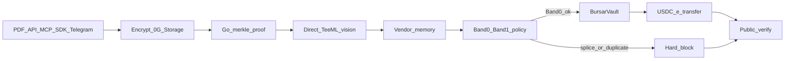
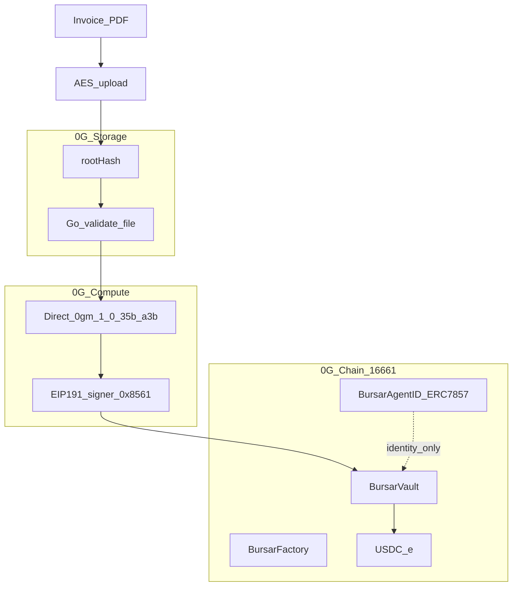
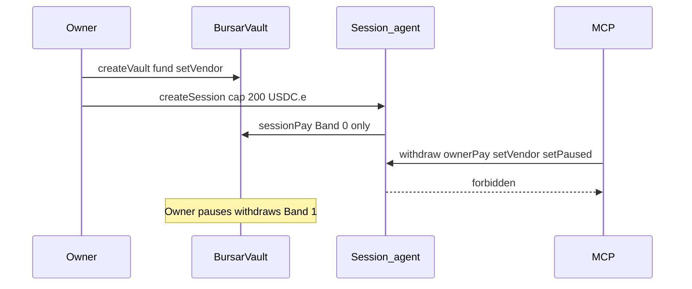
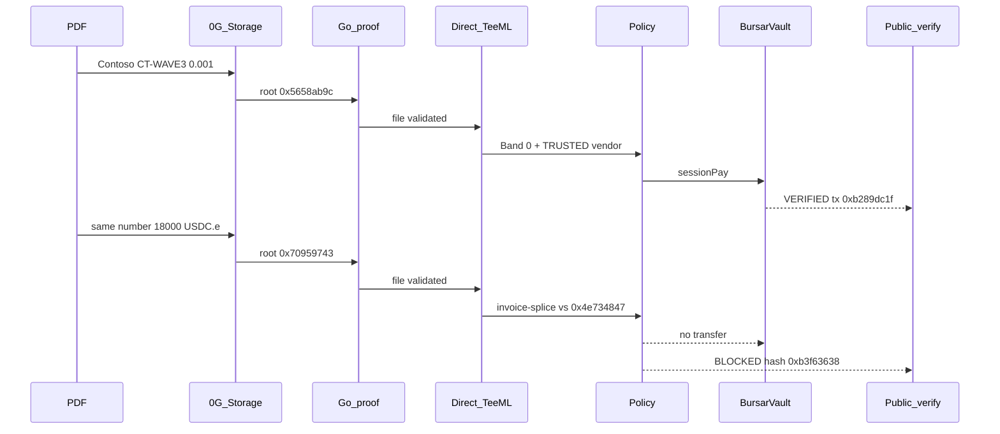

# BURSAR

[](https://github.com/james32135/BURSAR/actions/workflows/test.yml)

**Invoice in. Fake blocked. USDC paid.**

The accounts-payable clerk for crypto companies on **0G Aristotle chain 16661**. Direct TeeML reads the invoice. Policy owns the money. The agent never owns the treasury.

| Live | URL |
| --- | --- |
| Console | [bursarx.vercel.app](https://bursarx.vercel.app) |
| Owner desk (wallet) | [bursarx.vercel.app/start](https://bursarx.vercel.app/start) |
| 90s proofs (no wallet) | [bursarx.vercel.app/desk](https://bursarx.vercel.app/desk) |
| Public verify | [bursarx.vercel.app/verify](https://bursarx.vercel.app/verify) |
| API health | [bursar-api.onrender.com/health](https://bursar-api.onrender.com/health) |
| Telegram | [@BURSARxbot](https://t.me/BURSARxbot) |
| CI | [GitHub Actions](https://github.com/james32135/BURSAR/actions/workflows/test.yml) |

Start here as a judge: open [/desk](https://bursarx.vercel.app/desk) with no wallet, then click **Paid** and **Splice blocked**. Reconstruct both from ChainScan and StorageScan.

**Try the desk**, nav **Desk**, and **Open console** all open [Get started](https://bursarx.vercel.app/start): connect owner wallet, resume or bind the vault, authorize the agent. They do not open `/app` or the shared DEMO vault. DEMO is a labeled footer button on `/start` only.

---

## What it is

Crypto teams paste vendor addresses into Discord. A fake invoice gets paid. USDC does not come back.

BURSAR is the AP clerk that cannot steal:

1. A payable arrives (PDF, API, MCP, SDK, or Telegram).
2. Bytes are encrypted and stored on **0G Storage**.
3. The Go client downloads and **validates the merkle proof**.
4. **Direct TeeML** (`0gm-1.0-35b-a3b`) reads the invoice.
5. `processResponse` recovers the registered TEE signer via **EIP-191** (`0x8561E0a9…`).
6. Vendor memory + bands + duplicate hash + invoice-splice decide PAY / OPEN / WHY.
7. **BursarVault** moves USDC.e, or the path dies with **$0 moved**.
8. Anyone opens `/verify`. VERIFIED only when **Paid + USDC.e Transfer + Go proof** agree.

Email intake is not live. Settlement is **not** 0G Pay, Payment Layer, or Agentic ID. Agentic ID is clerk identity only.

---

## Product flow



Attention is the desk. Next action is only **PAY**, **OPEN**, **WHY**, or **PROOF**.

Owner vs agent:

- Owner wallet creates the vault, funds it, sets vendors, pauses, withdraws, pays Band 1.
- Session agent registers invoices and Band-0 pays. Cap $200. Cannot withdraw, change policy, or add vendors.
- MCP `withdraw` / `ownerPay` / `setVendor` / `setPaused` return `{error:"forbidden"}`.

---

## 0G integration (what actually runs)



| Module | Role in BURSAR | Proof | Status |
| --- | --- | --- | --- |
| **0G Chain** | Factory, isolated vault, Paid event, USDC.e `transfer` | [Owner vault](https://chainscan.0g.ai/address/0x8d9229d70Bef34D2C573ecf45dc984eA0a07c3De) | Live 16661 |
| **0G Compute** | Direct TeeML vision on the invoice | Model `0gm-1.0-35b-a3b`, provider [`0x4870CbC4…`](https://chainscan.0g.ai/address/0x4870CbC4D07d6Ac2EE5aA865588e5985FE77a4E9) | Live Direct ledger |
| **0G Storage** | Encrypted invoice + Go merkle download | Wave 3 root [0x5658ab9c…](https://storagescan.0g.ai/?root=0x5658ab9c60f2ff2cb7d2b00abafa6dca3a2bd95ad0ff97959fd88d1d6d944dff) | Live |
| **Agentic ID ERC-7857** | Clerk iNFT. Production IDs `0x2afbede9` / `0xdf597d99` / `0x74f8628b` | [BursarAgentID](https://chainscan.0g.ai/address/0x67b6FF6808dc7bB2a999809416113816d9f4707B) | Live. Identity, not settlement |
| **0G Pay** | Vendor rail | docs 404 | **Not claimed** |
| **0G DA** | Receipt layer | unused | **Not claimed** |
| **Hardware TEE quote** | dstack / verifyService | not on payment hot path | **Not claimed** |

`processResponse === true` is EIP-191 recovery, not a hardware quote. TypeScript Storage `proof: true` is not proof. `/verify` is VERIFIED only when Go logs `Succeeded to validate the downloaded file`.

`iTransferFrom` / `iCloneFrom` revert `NoMainnetAttestor`. `transferFrom` reverts `ERC7857UseITransferFrom`.

---

## Live contracts (Aristotle 16661)

| What | Address | Explorer |
| --- | --- | --- |
| BursarFactory | `0xEc0aEcF6C778f44AeA12ee17aFB38f4e0Af0A2A4` | [contract](https://chainscan.0g.ai/address/0xEc0aEcF6C778f44AeA12ee17aFB38f4e0Af0A2A4) |
| Factory deploy | `0x3ff08a8b4d1756439c80a8cfe5d3e47eb2fd81b12d0d9f13ec0278624667bac8` | [tx](https://chainscan.0g.ai/tx/0x3ff08a8b4d1756439c80a8cfe5d3e47eb2fd81b12d0d9f13ec0278624667bac8) |
| Owner vault (production) | `0x8d9229d70Bef34D2C573ecf45dc984eA0a07c3De` | [contract](https://chainscan.0g.ai/address/0x8d9229d70Bef34D2C573ecf45dc984eA0a07c3De) |
| DEMO vault (labeled) | `0xd572896BE92CDdb5cA1BeA7679eE2b995194710E` | [contract](https://chainscan.0g.ai/address/0xd572896BE92CDdb5cA1BeA7679eE2b995194710E) |
| USDC.e | `0x1f3AA82227281cA364bFb3d253B0f1af1Da6473E` | [token](https://chainscan.0g.ai/address/0x1f3AA82227281cA364bFb3d253B0f1af1Da6473E) |
| Session agent (owner workspace) | `0xF80132EE7FBb8ba04EDfe461B8C819cA25e9E326` | [address](https://chainscan.0g.ai/address/0xF80132EE7FBb8ba04EDfe461B8C819cA25e9E326) |
| Session id | `0x9aba79be6a708a266f72921a5170cdcc9510cedbf3bc8d04583b0cb3d6852de7` | on-chain session |
| Owner | `0xf76e6B0920e9332fF4410f6dD53F01722AbC71a3` | [address](https://chainscan.0g.ai/address/0xf76e6B0920e9332fF4410f6dD53F01722AbC71a3) |
| TEE signer (EIP-191) | `0x8561E0a9dA3C8d6591A2E756a91334f1a3E537e0` | [address](https://chainscan.0g.ai/address/0x8561E0a9dA3C8d6591A2E756a91334f1a3E537e0) |
| Compute provider | `0x4870CbC4D07d6Ac2EE5aA865588e5985FE77a4E9` | [address](https://chainscan.0g.ai/address/0x4870CbC4D07d6Ac2EE5aA865588e5985FE77a4E9) |
| BursarAgentID | `0x67b6FF6808dc7bB2a999809416113816d9f4707B` | [contract](https://chainscan.0g.ai/address/0x67b6FF6808dc7bB2a999809416113816d9f4707B) |
| AgentID deploy | `0x52e47e67aa0d1782441e001c9fa45d54c66ddff5fe6fea11cdd44fd6dc5d924d` | [tx](https://chainscan.0g.ai/tx/0x52e47e67aa0d1782441e001c9fa45d54c66ddff5fe6fea11cdd44fd6dc5d924d) |
| Vault fund +10000 units | `0x2adac519c0d58d3a2dc75031eef0a154051175b3f52f5726b90072a3c952fc54` | [tx](https://chainscan.0g.ai/tx/0x2adac519c0d58d3a2dc75031eef0a154051175b3f52f5726b90072a3c952fc54) |
| Clerk intelligentData hash | `0xd278e382e2507d471f1a4cb1058250129d563920c725ebe18e4bd7beb9c1273f` | on token 1 |

Band 0 (session): $200. Band 1 (owner): $10,000. Rail fail-closed: `usdc.e-16661` only.

---

## Wave 3 featured proofs (use these first)

### Paid (money moved)

Contoso invoice `CT-WAVE3-1788044474213`, 0.001 USDC.e, vendor `0x1111…1111`.

| Field | Value | Link |
| --- | --- | --- |
| Payable hash | `0x4e7348478853a382c5fe758b41e6cfbfac0264a2a954daa2e95745cd2bc1cf5a` | API invoice |
| Session pay tx | `0xb289dc1f51d6974d8872e0b31a80ce1dd4d15aaf05dcc8fd2c8740f5d9ebdf3e` | [ChainScan](https://chainscan.0g.ai/tx/0xb289dc1f51d6974d8872e0b31a80ce1dd4d15aaf05dcc8fd2c8740f5d9ebdf3e) |
| `/verify` | VERIFIED | [verify](https://bursarx.vercel.app/verify/0xb289dc1f51d6974d8872e0b31a80ce1dd4d15aaf05dcc8fd2c8740f5d9ebdf3e) |
| Storage root | `0x5658ab9c60f2ff2cb7d2b00abafa6dca3a2bd95ad0ff97959fd88d1d6d944dff` | [StorageScan](https://storagescan.0g.ai/?root=0x5658ab9c60f2ff2cb7d2b00abafa6dca3a2bd95ad0ff97959fd88d1d6d944dff) |
| Response hash | `0x451b637dc6352f6c3185122801e426075b61bd545c6a95b8ee02a0c9990c2a48` | in Paid event |
| USDC.e Transfer | vault `0x8d9229…` → `0x1111…` 1000 units | on the pay tx |
| Go proof | `Succeeded to validate the downloaded file` | `/verify` goProof.ok |
| didMoneyMove | true | `/verify` |

### Blocked (splice, $0)

Same invoice number, amount raised. New hash. Session `POST /pay` → **400 blocked**.

| Field | Value | Link |
| --- | --- | --- |
| Payable hash | `0xb3f63638b970cfbeadadd39d44ec1ad43a986cb8304a292b1182e6453b0c2a37` | [verify](https://bursarx.vercel.app/verify/0xb3f63638b970cfbeadadd39d44ec1ad43a986cb8304a292b1182e6453b0c2a37) |
| Status | BLOCKED (`invoice-splice`) | no pay tx |
| Storage root | `0x70959743f3dea57545772f2bb9dbc2b7b163e075a3b60513c18925d80b9c312f` | [StorageScan](https://storagescan.0g.ai/?root=0x70959743f3dea57545772f2bb9dbc2b7b163e075a3b60513c18925d80b9c312f) |
| USDC.e moved | 0 | fail-closed |

Hash replay of a paid invoice reverts `DuplicateInvoice` on-chain. Splice is a **new** PDF with the same invoice number and a different amount. That is a different flag.

---

## More verified pays (same vault)

| Label | Pay tx | Invoice | Storage root |
| --- | --- | --- | --- |
| Owner Contoso Band-0 | [0x28b11d3a…](https://chainscan.0g.ai/tx/0x28b11d3a45b362a90d3d951b7865e9648b83fc3786cb395c20be491958967e49) | `0x31d4d693803cf83a3211938966a45de89a2eaf1655fd02d29c673977a74d9385` | [0x334c92b5…](https://storagescan.0g.ai/?root=0x334c92b5a0a213ab0c185ccb4432402ff01acd67c51ed25771493c1d14ad7001) |
| Telegram Contoso Band-0 | [0x4f055211…](https://chainscan.0g.ai/tx/0x4f055211a54c593c783d340d06a8bb9bd2cb0fc52d811f1856914208c981687b) | `0x1e85222c0ed7b8bd03c3db0a61664b77fee4801ad572ef7a7331f7eb170080af` | [0x218281ef…](https://storagescan.0g.ai/?root=0x218281ef3d1c73b0bc67bf03a4025fbe116d0a351b729e75a82b69383916ab91) |
| Chrome Band-0 | [0x817ff501…](https://chainscan.0g.ai/tx/0x817ff5010e0cb04293b2c0241e15e635cf5a2cc0e8e2511379c4ad0fef262e2b) | `0xc328eabde3fecf4dc88bd4c24ea7fff1f34f89d31c9025e96d926e14202326e1` | `/verify` |
| API Band-0 | [0x6e3cff64…](https://chainscan.0g.ai/tx/0x6e3cff64939839eacf888ec92acef3a61825ed0ae624e09e77a9ca910d1de70b) | `0x33ea8d12c9f892c31debf29c34f5a41c776219a0e2f7a0f6cff2b8f2c4bc754a` | `/verify` |
| Recovery Band-0 | [0x4bb6eafa…](https://chainscan.0g.ai/tx/0x4bb6eafa4aa3d39efc9ab4e5cb4b920e304b7004c1621785756140156d85fd34) | `0x008bc867b8cb11c2685cc27ff01dc0cd160126e4a314b0eb773241d70aab5456` | `/verify` |
| Owner-workspace Band-0 | [0x0290bcb0…](https://chainscan.0g.ai/tx/0x0290bcb024eeba773d9f97c493e8e6abb0da4191606feec9e8cf0ffff7919f49) | | `/verify` |
| Owner Northwind Band-0 | [0x91007ec4…](https://chainscan.0g.ai/tx/0x91007ec49c0f757cb2a20a9f5d58396a3d79cef62c91c60500409242751d7f63) | | `/verify` |

Public reconstruct: `https://bursar-api.onrender.com/verify/<tx-or-invoice-hash>`.

---

## ERC-7857 clerk identity

`cast call` on `0x67b6FF68…` returns **true** for:

- IERC165 `0x01ffc9a7`
- IERC721 `0x80ac58cd`
- IERC7857 `0x2afbede9`
- IERC7857Authorize `0xdf597d99`
- IERC7857Cloneable `0x74f8628b`

Control id `0xdeadbeef` is false. `/verify` shows this table with no wallet.

---

## Adapters

| Channel | Live | How |
| --- | --- | --- |
| PDF | yes | Console Inbox drop. Same hash engine. |
| HTTP API | yes | `POST /invoices` with workspace bearer |
| MCP | yes | `node packages/mcp/src/server.mjs` |
| SDK | yes | `@bursar/sdk` in this repo |
| Telegram | yes | [@BURSARxbot](https://t.me/BURSARxbot) bind code from Settings |
| Email | no | health stays false until mailbox + secret exist |

---

## What's new this Wave

- Attention home. Next action PAY / OPEN / WHY / PROOF.
- Production ERC-7857 BursarAgentID on 16661.
- Invoice-splice block (same number, different amount) before Band 0.
- Public `/verify` + `/desk` with live Paid vs Block chips.
- GitHub Actions: `forge test` + backend unit tests.
- Telegram `/help` is the mobile clerk.

---

## Owner vs agent (isolation)



Workspace rows are isolated. MCP cannot touch another workspace treasury. The DEMO vault `0xd572896B…` is labeled. Production proof uses owner vault `0x8d9229d7…`.

---

## Pay vs splice (same invoice number)



Hash replay of the paid bytes reverts `DuplicateInvoice` on-chain. Splice is a **new** PDF. Different hash. Same invoice number. Different amount.

---

## Reconstruct proofs yourself

No wallet. Copy a hash from this README.

```bash
curl -s https://bursar-api.onrender.com/health
curl -s https://bursar-api.onrender.com/identity
curl -s https://bursar-api.onrender.com/verify/0xb289dc1f51d6974d8872e0b31a80ce1dd4d15aaf05dcc8fd2c8740f5d9ebdf3e
curl -s https://bursar-api.onrender.com/verify/0xb3f63638b970cfbeadadd39d44ec1ad43a986cb8304a292b1182e6453b0c2a37
```

| Check | Expect |
| --- | --- |
| `/health` | `chainId` 16661, `vault` owner vault, telegram true, email false, settlement vault USDC.e |
| `/identity` | `supportsInterface.IERC7857` true, control id false |
| `/verify/0xb289dc1f…` | `status` VERIFIED, `didMoneyMove` true, `goProof.ok` true, storage root `0x5658ab9c…` |
| `/verify/0xb3f63638…` | `status` BLOCKED, 0 USDC.e |

Then open the same hashes on [ChainScan](https://chainscan.0g.ai) and [StorageScan](https://storagescan.0g.ai).

---

## How to record the demo (new user, web + bot)

Host on YouTube or Loom. Max 3 minutes. Also cut a 60 second version.

**Setup (once, off camera):** Chrome logged into the owner workspace on [bursarx.vercel.app/app](https://bursarx.vercel.app/app). Telegram bound as Elan3510. Do not pause the vault. Do not expire the session. Do not create a second vault for `0xf76e…`.

**60 seconds**

1. Open [bursarx.vercel.app](https://bursarx.vercel.app). Read the two hero cards: Paid and Blocked.
2. Click Paid. `/verify` shows VERIFIED. Click ChainScan. Click Storage root.
3. Back. Click Blocked. Status BLOCKED. $0.
4. Open Telegram `@BURSARxbot` `/help` then `/payments`. Point at the same pay tx.

**3 minutes (new-user path)**

1. **0:00 Chain first.** ChainScan pay [0xb289dc1f…](https://chainscan.0g.ai/tx/0xb289dc1f51d6974d8872e0b31a80ce1dd4d15aaf05dcc8fd2c8740f5d9ebdf3e). Success. USDC.e Transfer 1000 units vault → vendor.
2. **0:25 Landing.** Invoice in. Fake blocked. USDC paid. Horizontal 0G stack: Chain, Compute, Storage, Agentic ID, Not claimed.
3. **0:50 Desk.** [/desk](https://bursarx.vercel.app/desk) side by side. No wallet.
4. **1:10 Console.** Attention. Upload a Contoso PDF (or open an existing payable). PipelineStrip: Received → Storage verified → Private AI → Decision → Pay / Blocked.
5. **1:40 Splice.** Open blocked payable. WHY: same invoice number, different amount. PAY returns blocked.
6. **2:00 Telegram.** `/start`, `/help`, drop PDF or inspect hash, show PAY only on Band 0, show `/payments`.
7. **2:20 Identity.** `/verify` ERC-7857 table true / control false. iTransfer NoMainnetAttestor.
8. **2:40 Honest close.** Settlement is vault USDC.e. processResponse is EIP-191. 0G Pay not claimed. Email not live.

Record 1920x1080, cursor visible, no music over explorer URLs. Speak the tx hash once.

---

## Local run

1. Copy `.env.example` to `.env`. Never commit `.env`.
2. API: `cd backend && npm install && npx tsx src/index.ts` (8787)
3. UI: `cd apps/web && npm install && npm run dev` (5173)
4. MCP: `node packages/mcp/src/server.mjs`
5. Foundry: `cd contracts && forge install foundry-rs/forge-std@v1.9.6 && forge test`

Vercel Root Directory must be `apps/web`. Install `npm install`. Build `npm run build`. Output `dist`.

---

## Tests

- `forge test` - vault, factory, invariants, BursarAgentID
- `cd backend && npx tsx --test --test-concurrency=1 test/attestor.test.ts test/identity.test.ts test/payable.test.ts test/rails.test.ts test/obligations.test.ts test/mcp-tools.test.ts test/pay-gates.test.ts`
- MCP treasury tools return `{error:"forbidden"}`

---

## Honest limitations

- TEE `verifyService` / dstack quote is not on the payment hot path
- Direct TLS is public Let's Encrypt, not RA-TLS
- 0G Pay docs 404. Payment Layer is inference 0G only
- Agentic ID is clerk identity, not vendor settlement
- Email mailbox is not live
- User B HTTP isolation is unit/HTTP tested, not a second live human
